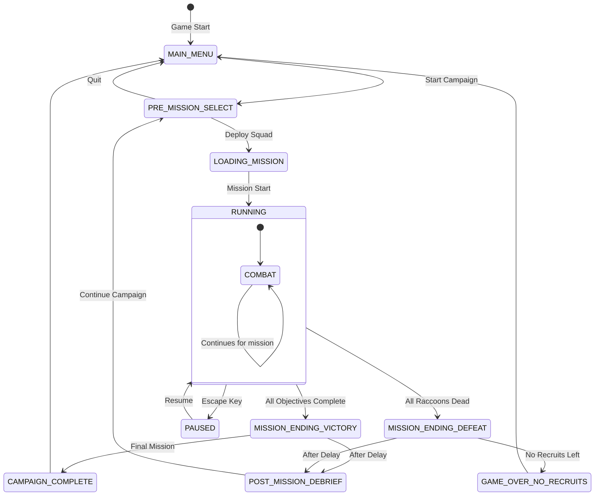

# Music System Plan for Raccoon Platoon

## Overview

This document outlines a comprehensive music system that provides:
- Music for all game states (menu, gameplay, victory, defeat, etc.)
- Biome-specific and mission-type-specific music variations
- A combat intensity system that responds to gameplay
- Layered audio (ambient + music) that plays simultaneously
- Easy-to-maintain configuration for adding new songs

---

## 1. Music Categories

The following categories require distinct music tracks:

| Category | Game State | Description |
|----------|------------|-------------|
| **Main Menu** | `MAIN_MENU` | Title screen music - sets the tone for the game |
| **Pre-Mission Select** | `PRE_MISSION_SELECT` | Uses MAIN_MENU music (continues from menu or restarts) |
| **Loading** | `LOADING_MISSION` | Loading screen - can use ambient or cinematic tracks |
| **Campaign Debrief** | `POST_MISSION_DEBRIEF` | Victory/Defeat music continues playing |
| **Mission Gameplay** | `RUNNING` | Combat music - has intensity system (see below) |
| **Boss Fight** | `RUNNING` (boss present) | High-intensity boss battle music |
| **Victory** | `MISSION_ENDING_VICTORY` | Triumphant win jingle |
| **Defeat** | `MISSION_ENDING_DEFEAT` | Somber/mourning track |
| **Pause** | `PAUSED` | Muted or quiet ambient (or silence) |
| **Shootout Mode** | `SHOOTOUT_PRE_GAME`, `SHOOTOUT_PLAYING` | Practice range music |
| **Campaign Complete** | `CAMPAIGN_COMPLETE` | Epic finale music |
| **Game Over** | `GAME_OVER_NO_RECRUITS` | Final defeat - end of campaign |
| **How to Play** | `HOW_TO_PLAY` | Uses MAIN_MENU music |

---

## 2. Simple Mission Music (v1)

For the initial implementation, combat music will be a simple playlist:
- Play through campaign music tracks sequentially or shuffle
- Single track plays for entire mission duration
- Ambient continues underneath

**Future Roadmap:** Intensity system (Low → Medium → High → Boss)

---

## 3. Layering System (Ambient + Music)

The system supports **layered audio** where multiple tracks play simultaneously:

```
┌─────────────────────────────────────────┐
│           Music Layer (Combat)           │
│  ┌─────────────────────────────────────┐ │
│  │  Campaign combat track              │ │
│  │  (plays for entire mission)          │ │
│  └─────────────────────────────────────┘ │
├─────────────────────────────────────────┤
│          Ambient Layer (Forest)          │
│  ┌─────────────────────────────────────┐ │
│  │  Continuous ambient soundscape      │ │
│  └─────────────────────────────────────┘ │
├─────────────────────────────────────────┤
│           SFX Layer (Gunshots)           │
│  ┌─────────────────────────────────────┐ │
│  │  One-shot sound effects             │ │
│  └─────────────────────────────────────┘ │
└─────────────────────────────────────────┘
```

### Volume Mix Example

| Scenario | Music Vol | Ambient Vol |
|----------|-----------|-------------|
| Menu | 0.7 | 0.0 |
| Mission Start | 0.3 | 0.4 |
| Combat | 0.5 | 0.3 |
| Victory | 0.8 | 0.2 |

---

## 4. MusicManager Class Design

Create a new `js/musicManager.js` that extends/uses `AudioManager`:

```javascript
class MusicManager {
  constructor(audioManager) {
    this.audioManager = audioManager;
    this.currentCategory = null;
    this.currentBiome = null;
    
    // Layered playback
    this.musicLayer = { key: null, instance: null, volume: 0.5 };
    this.ambientLayer = { key: null, instance: null, volume: 0.4 };
  }

  // --- Core Methods ---
  
  setGameState(state, params = {}) {
    // Transition music based on game state
  }
  
  setBiome(biomeType) {
    // Load biome-specific ambient tracks
  }
  
  // --- Layer Management ---
  
  playMusic(trackKey, options = {}) {
    // Play music track
  }
  
  playAmbient(trackKey, options = {}) {
    // Play ambient underneath music
  }
  
  setMusicVolume(vol) { /* ... */ }
  setAmbientVolume(vol) { /* ... */ }
  
  // --- Stop ---
  
  stopAll() {
    this.musicLayer.instance?.stop();
    this.ambientLayer.instance?.stop();
  }
}
```

---

## 5. CONFIG Structure

Add to `js/config.js`:

```javascript
AUDIO_MUSIC: {
  // Master volume controls
  DEFAULT_MUSIC_VOLUME: 0.5,
  DEFAULT_AMBIENT_VOLUME: 0.4,
  
  // Simple transition time
  STATE_TRANSITION_TIME: 1.0,
  
  // Per biome track lists
  BIOME_TRACKS: {
    TROPICAL: {
      ambient: ['AMBIENT_TROPICAL_1', 'AMBIENT_TROPICAL_2', ...],
      combat: ['MUSIC_COMBAT_1', 'MUSIC_COMBAT_2', 'MUSIC_COMBAT_3'],
      victory: 'MUSIC_VICTORY_TROPICAL',
      defeat: 'MUSIC_DEFEAT'
    },
    TEMPERATE: {
      ambient: ['AMBIENT_TEMPERATE_1', ...],
      combat: ['MUSIC_COMBAT_1', 'MUSIC_COMBAT_2', 'MUSIC_COMBAT_3'],
      victory: 'MUSIC_VICTORY_TEMPERATE',
      defeat: 'MUSIC_DEFEAT'
    }
  },
  
  // Mission type overrides (only boss needs special music)
  MISSION_TYPE_TRACKS: {
    BOSS: { combat: { boss: ['MUSIC_BOSS_1', 'MUSIC_BOSS_2'] } }
  },
  
  // Game state tracks (fallback/default)
  STATE_TRACKS: {
    MAIN_MENU: 'MUSIC_MAIN_MENU',
    PRE_MISSION_SELECT: 'MUSIC_MAIN_MENU',  // Uses main menu music
    LOADING_MISSION: 'MUSIC_LOADING',
    POST_MISSION_DEBRIEF: null,  // Keeps playing VICTORY or DEFEAT music
    VICTORY: 'MUSIC_VICTORY_DEFAULT',
    DEFEAT: 'MUSIC_DEFEAT',
    PAUSE: null, // silence
    SHOOTOUT_PRE_GAME: 'MUSIC_SHOOTOUT',
    SHOOTOUT_PLAYING: 'MUSIC_SHOOTOUT',
    CAMPAIGN_COMPLETE: 'MUSIC_CAMPAIGN_COMPLETE',
    GAME_OVER_NO_RECRUITS: 'MUSIC_GAME_OVER',
    HOW_TO_PLAY: 'MUSIC_MAIN_MENU',  // Uses main menu music
  }
}
```

---

## 6. Audio Asset Paths

Add to `CONFIG.AUDIO_ASSETS` in `js/config.js`:

```javascript
AUDIO_ASSETS: {
  // ... existing sounds ...
  
  // --- MUSIC TRACKS ---
  
  // Main Menu (also used for Pre-Mission Select, How to Play)
  MUSIC_MAIN_MENU: { path: 'assets/audio/music/main_menu.mp3', defaultVolume: 0.6 },
  
  // Mission Combat Music (simple - plays for entire mission)
  MUSIC_COMBAT_1: { path: 'assets/audio/music/combat_1.mp3', defaultVolume: 0.5 },
  MUSIC_COMBAT_2: { path: 'assets/audio/music/combat_2.mp3', defaultVolume: 0.5 },
  MUSIC_COMBAT_3: { path: 'assets/audio/music/combat_3.mp3', defaultVolume: 0.5 },
  
  // Boss Music
  MUSIC_BOSS_1: { path: 'assets/audio/music/boss_1.mp3', defaultVolume: 0.7 },
  MUSIC_BOSS_2: { path: 'assets/audio/music/boss_2.mp3', defaultVolume: 0.7 },
  
  // Victory/Defeat
  MUSIC_VICTORY_DEFAULT: { path: 'assets/audio/music/victory.mp3', defaultVolume: 0.7 },
  MUSIC_DEFEAT: { path: 'assets/audio/music/defeat.mp3', defaultVolume: 0.5 },
  
  // Other States (Pre-Mission uses Main Menu, Debrief keeps victory/defeat)
  MUSIC_LOADING: { path: 'assets/audio/music/loading.mp3', defaultVolume: 0.4 },
  MUSIC_SHOOTOUT: { path: 'assets/audio/music/shootout.mp3', defaultVolume: 0.5 },
  MUSIC_CAMPAIGN_COMPLETE: { path: 'assets/audio/music/campaign_complete.mp3', defaultVolume: 0.8 },
  MUSIC_GAME_OVER: { path: 'assets/audio/music/game_over.mp3', defaultVolume: 0.6 },
  
  // Ambient (separate from combat music)
  AMBIENT_TROPICAL_1: { path: 'assets/audio/ambience/tropical_forest_ambient_1.mp3', defaultVolume: 0.45 },
  AMBIENT_TROPICAL_2: { path: 'assets/audio/ambience/tropical_forest_ambient_2.mp3', defaultVolume: 0.45 },
  AMBIENT_TEMPERATE_1: { path: 'assets/audio/ambience/temperate_forest_ambient_1.mp3', defaultVolume: 0.45 },
  // ... more ambient tracks
}
```

---

## 7. Game State → Music Transition Map

```javascript
const MUSIC_TRANSITIONS = {
  // State changes and their music behavior
  transitions: [
    { from: null, to: 'MAIN_MENU', action: 'play', track: 'STATE_TRACKS.MAIN_MENU', ambient: null },
    { from: 'MAIN_MENU', to: 'PRE_MISSION_SELECT', action: 'play', track: 'STATE_TRACKS.PRE_MISSION_SELECT' },
    { from: 'PRE_MISSION_SELECT', to: 'LOADING_MISSION', action: 'crossfade', track: 'STATE_TRACKS.LOADING_MISSION' },
    { from: 'LOADING_MISSION', to: 'RUNNING', action: 'playCombat', track: null /* determined by biome/mission */ },
    { from: 'RUNNING', to: 'MISSION_ENDING_VICTORY', action: 'play', track: 'biome.victory or STATE_TRACKS.VICTORY' },
    { from: 'RUNNING', to: 'MISSION_ENDING_DEFEAT', action: 'play', track: 'STATE_TRACKS.DEFEAT' },
    { from: 'MISSION_ENDING_VICTORY', to: 'POST_MISSION_DEBRIEF', action: 'play', track: 'STATE_TRACKS.POST_MISSION_DEBRIEF' },
    { from: 'POST_MISSION_DEBRIEF', to: 'PRE_MISSION_SELECT', action: 'play', track: 'STATE_TRACKS.PRE_MISSION_SELECT' },
    { from: 'RUNNING', to: 'PAUSED', action: 'fadeOut', track: null },
    { from: 'PAUSED', to: 'RUNNING', action: 'fadeIn', track: null /* resume previous */ },
    { from: 'RUNNING', to: 'SHOOTOUT_PLAYING', action: 'play', track: 'STATE_TRACKS.SHOOTOUT_PLAYING' },
    { from: 'any', to: 'CAMPAIGN_COMPLETE', action: 'play', track: 'STATE_TRACKS.CAMPAIGN_COMPLETE' },
    { from: 'any', to: 'GAME_OVER_NO_RECRUITS', action: 'play', track: 'STATE_TRACKS.GAME_OVER_NO_RECRUITS' },
  ]
};
```

---

## 8. Implementation Steps

### Step 1: Extend AudioManager
- Add crossfade capability to `AudioManager`
- Add layered playback support (multiple simultaneous loops)

### Step 2: Create MusicManager
- Create `js/musicManager.js` class
- Implement state-based music selection
- Implement biome selection

### Step 3: Update CONFIG
- Add `AUDIO_MUSIC` configuration section
- Add music tracks to `AUDIO_ASSETS`

### Step 4: Integrate with Game
- Initialize `MusicManager` in `Game` constructor
- Add music state change hooks in `Game.update()` 

### Step 5: Add Music Files
- Place new music files in `assets/audio/music/`
- Add entries to `CONFIG.AUDIO_ASSETS`

---

## 9. Mermaid Diagram: Music State Flow



---

## 10. Summary

This music system provides:

1. **Modular Design** - Easy to add new tracks by editing config
2. **Dynamic Response** - Combat intensity adapts to gameplay
3. **Layered Audio** - Ambient + music play simultaneously
4. **Biome Support** - Different music for different environments
5. **Mission Variety** - Music varies by mission type
6. **Smooth Transitions** - Crossfades between tracks and states

The implementation requires creating a `MusicManager` class, updating the config, and integrating with the game's state machine. Once complete, you'll have a rich, immersive audio experience that responds to player actions.
