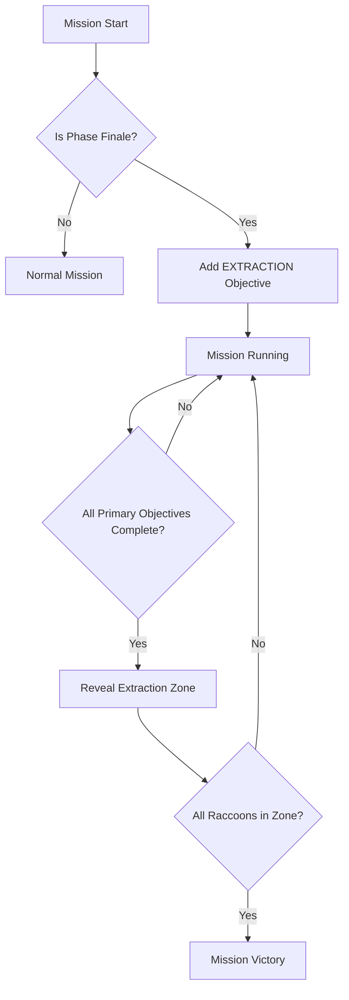

# Phase Finale Extraction Feature Plan

## Overview

This plan outlines the implementation of a mandatory extraction mechanic for phase finale missions in Raccoon Platoon. Currently, extraction zones only appear when rescuing hostages. The feature will extend this to require all surviving raccoons to extract via a blue extraction zone at the end of every phase finale mission.

## Current System Analysis

### How Phase Finales Work
- Phase finales are detected in [`game.js:1583`](js/game.js:1583) via `isPhaseFinale = (missionIdx === currentPhaseInfo.missionsInPhase - 1)`
- Phase finales automatically get ASSASSINATION as the first primary objective (with boss target)
- Other secondary objectives can still be selected

### How Extraction Currently Works
- Extraction zones are only created in [`levelGenerator.js:470-505`](js/levelGenerator.js:470) when `RESCUE_HOSTAGES` objective exists
- Zone is hidden initially (`isHidden: true`) and revealed when hostages are rescued
- Mission completion requires:
  1. All objectives complete
  2. All rescued hostages in extraction zone
  3. At least one raccoon in extraction zone

### Key Files to Modify
1. [`js/game.js`](js/game.js) - Mission status checking and completion logic
2. [`js/levelGenerator.js`](js/levelGenerator.js) - Extraction zone spawning
3. [`js/config.js`](js/config.js) - UI text strings
4. [`js/campaignRules.js`](js/campaignRules.js) - Objective definitions (if needed)
5. [`js/ui.js`](js/ui.js) - Objective display

---

## Implementation Plan

### Step 1: Add New Objective Type in campaignRules.js

Add a new EXTRACTION objective type to the OBJECTIVE_POOL:

```javascript
{
    type: "EXTRACTION",
    weight: 0, // Not randomly selected - always added for phase finales
    unlocksPhase: 0,
    descriptionTemplateKey: "OBJECTIVE_EXTRACTION_TEXT",
    completionCondition: "ALL_RACCOONS_EXTRACTED",
    isPrimary: false, // Added automatically, not counted as primary
    canCoexistWith: ["EXTERMINATE", "DESTROY_TARGET", "ASSASSINATION", "RESCUE_HOSTAGES"],
    maxInstancesPerMission: 1,
    isPhaseFinaleOnly: true // Custom flag we add
}
```

### Step 2: Modify game.js - Mission Generation

In [`generateAndSetCurrentMissionParams()`](js/game.js:1502), after selecting objectives, add:

```javascript
// For phase finales, add extraction requirement
const isPhaseFinale = (missionIdx === currentPhaseInfo.missionsInPhase - 1);
if (isPhaseFinale) {
    // Check if extraction objective already exists (from RESCUE_HOSTAGES)
    const hasExtractionObj = currentMissionParams.objectives.some(o => o.type === 'EXTRACTION');
    if (!hasExtractionObj) {
        const extractionObjDef = this.campaignRules.OBJECTIVE_POOL.find(o => o.type === "EXTRACTION");
        if (extractionObjDef) {
            const extractionObj = this._instantiateObjective(
                JSON.parse(JSON.stringify(extractionObjDef)),
                phaseIdx,
                false
            );
            if (extractionObj) {
                currentMissionParams.objectives.push(extractionObj);
            }
        }
    }
}
```

### Step 3: Modify levelGenerator.js - Zone Spawning

In [`generate()`](js/levelGenerator.js:267), modify the extraction zone creation logic to also check for phase finale missions:

```javascript
// Current logic (line 470):
const rescueObjectiveInstance = missionObjectives.find(obj => obj.type === 'RESCUE_HOSTAGES');

// New logic:
const rescueObjectiveInstance = missionObjectives.find(obj => obj.type === 'RESCUE_HOSTAGES');
const extractionObjectiveInstance = missionObjectives.find(obj => obj.type === 'EXTRACTION');
const hasExtractionRequirement = rescueObjectiveInstance || extractionObjectiveInstance;

if (hasExtractionRequirement) {
    // ... existing extraction zone creation code ...
}
```

Note: The phase finale check needs to be passed into the level generator or we add EXTRACTION to missionObjectives before calling generate.

### Step 4: Modify game.js - checkMissionStatus()

Update [`checkMissionStatus()`](js/game.js:2092) to handle the new EXTRACTION objective:

```javascript
// Add new case in the objective checking loop:
} else if (obj.type === 'EXTRACTION') {
    const extractionZones = this.level.obstacles.filter(obs => obs.type === 'extraction_zone');
    
    // Check if all living raccoons are in extraction zone
    let allRaccoonsExtracted = true;
    let anyRaccoonInZone = false;
    
    if (this.deployedSquadRoster) {
        const livingRaccoons = this.deployedSquadRoster.filter(r => r.isAlive());
        
        if (livingRaccoons.length === 0) {
            allRaccoonsExtracted = false; // Should have been caught by squad wiped check
        } else {
            for (const raccoon of livingRaccoons) {
                let raccoonInZone = false;
                for (const zone of extractionZones) {
                    if (raccoon.x >= zone.x && raccoon.x <= zone.x + zone.width &&
                        raccoon.y >= zone.y && raccoon.y <= zone.y + zone.height) {
                        raccoonInZone = true;
                        anyRaccoonInZone = true;
                        break;
                    }
                }
                if (!raccoonInZone) {
                    allRaccoonsExtracted = false;
                    break;
                }
            }
        }
    }
    
    obj.currentProgress = anyRaccoonInZone ? 1 : 0;
    obj.isComplete = allRaccoonsExtracted;
    
    // Reveal extraction zone when primary objectives are complete
    if (!obj.extractionZoneRevealed) {
        const primaryObjectives = this.currentMissionParams.objectives.filter(o => o.isPrimary !== false);
        const allPrimaryComplete = primaryObjectives.every(o => o.isComplete);
        
        if (allPrimaryComplete) {
            obj.extractionZoneRevealed = true;
            const extractionZoneObs = this.level.obstacles.filter(obs => obs.type === 'extraction_zone');
            extractionZoneObs.forEach(ezObs => {
                ezObs.isHidden = false;
                this.addVisualEffect('extraction_zone', { obstacle: ezObs });
            });
            if (this.ui) this.ui.updateObjective();
        }
    }
}
```

### Step 5: Add UI Text Strings in config.js

Add new text strings for the extraction objective:

```javascript
OBJECTIVE_EXTRACTION_TEXT: "Extract All Units: {CURRENT}/{TOTAL}",
OBJECTIVE_EXTRACTION_PROCEED: "All objectives complete! Proceed to Extraction Zone!",
MISSION_BRIEFING_EXTRACTION_APPEND: " Once all objectives are complete, proceed to the extraction zone for evac.",
```

### Step 6: Update Briefing Text

In [`game.js`](js/game.js), modify the briefing generation to append extraction info for phase finales:

```javascript
// In generateAndSetCurrentMissionParams(), after briefing generation:
// Check if this is a phase finale and add extraction note
if (isPhaseFinale) {
    const extractionNote = this.campaignRules.MISSION_BRIEFING_EXTRACTION_APPEND || 
        " Once all objectives are complete, proceed to the extraction zone for evac.";
    baseP.briefing += extractionNote;
}
```

### Step 7: Update Mission End Logic

The current logic at [`game.js:2236-2238`](js/game.js:2236) will work because:
- EXTRACTION objective will be added to objectives array
- When all objectives (including EXTRACTION) are complete, mission ends

---

## Visual Flow



---

## Edge Cases to Handle

1. **RESCUE_HOSTAGES in Phase Finale**: Should still work - both hostage rescue AND extraction required
2. **All Raccoons Die**: Handled by existing squad wiped check
3. **Raccoons in Extraction but Dead**: Dead raccoons don't count - must be alive in zone
4. **Save/Load**: Objective state should serialize correctly (already handled by existing structure)
5. **Retry Mission**: Should regenerate properly

---

## Files Summary

| File | Changes | Complexity |
|------|---------|-------------|
| campaignRules.js | Add EXTRACTION objective definition | Low |
| game.js | Add objective to phase finales, update checkMissionStatus | Medium |
| levelGenerator.js | Spawn extraction zone for EXTRACTION objective | Low |
| config.js | Add UI text strings | Low |
| ui.js | Likely no changes needed (uses objective system) | None |

---

## Testing Checklist

- [ ] Phase finale without hostages: extraction zone appears after objectives
- [ ] Phase finale with hostages: both extraction work together
- [ ] Non-phase finale: no extraction requirement (existing behavior)
- [ ] Briefing text shows extraction requirement for phase finales
- [ ] UI shows correct objective status
- [ ] Mission completes only when all raccoons in zone
- [ ] Victory screen shows correctly after extraction
