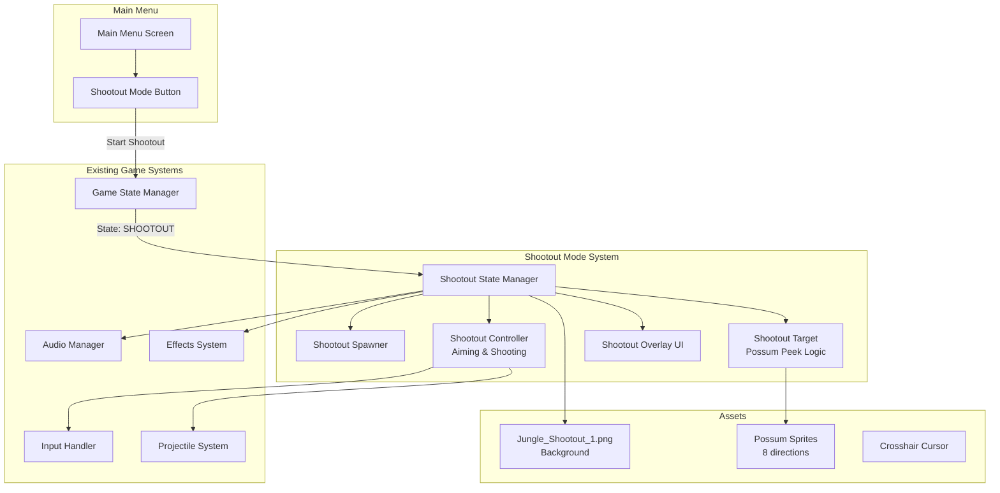

# Shootout Mode - Implementation Plan

## Overview
A new arcade-style FPS game mode where the player looks out from a stationary helicopter overlooking a jungle environment. Possum enemies peek out from behind trees and the player must shoot them before they fire back using only a crosshair cursor (no helicopter image visible - pure FPS style). This mode will initially be accessible from the main menu, with the eventual goal of being randomly integrated into the campaign.

---

## Architecture Diagram



---

## Core Game States (New State Added)

| State | Description |
|-------|-------------|
| `MAIN_MENU` | Existing - Add Shootout button |
| `SHOOTOUT_PRE_GAME` | New - Show instructions/score goals |
| `SHOOTOUT_PLAYING` | New - Active gameplay |
| `SHOOTOUT_PAUSED` | New - Pause menu during shootout |
| `SHOOTOUT_GAME_OVER` | New - Show final score, retry/main menu |

---

## New Classes & Components

### 1. ShootoutTarget (New Enemy Type)
**File:** `js/shootoutTarget.js`

A specialized possum variant for the shootout mode with "peek" behavior.

```javascript
class ShootoutTarget extends Unit {
    // Properties
    - treePosition: {x, y}      // Position behind tree
    - peekPosition: {x, y}      // Position when peeking out
    - currentState: 'HIDDEN' | 'PEEKING' | 'SHOOTING' | 'HIT' | 'DEAD'
    - peekTimer: number         // Time tracking for state changes
    - peekDuration: number      // How long they stay peeking
    - reactionTime: number      // Delay before shooting at player
    - isHit: boolean            // Target has been shot
    
    // Methods
    + update(deltaTime)
    + render(ctx, cameraX, cameraY)
    + peek()                    // Start peeking from behind tree
    + hide()                    // Return behind tree
    + shootAtPlayer()           // Fire at player helicopter
    + onHit(damage)             // Handle being shot
    + setTreePosition(x, y)     // Set the tree cover position
}
```

**State Machine:**
```
HIDDEN -> PEEKING (after random delay)
PEEKING -> SHOOTING (after reactionTime)
PEEKING -> HIDDEN (after peekDuration, if not shot)
SHOOTING -> HIDDEN (after firing)
ANY -> HIT -> DEAD (when shot)
```

### 2. ShootoutSpawner
**File:** `js/shootoutSpawner.js`

Manages spawning and positioning of targets.

```javascript
class ShootoutSpawner {
    // Properties
    - game: Game instance
    - activeTargets: ShootoutTarget[]
    - treePositions: {x, y, type}[]  // Valid spawn locations from config
    - maxConcurrentTargets: number
    - spawnTimer: number
    - spawnInterval: number         // Time between spawns
    - difficultyMultiplier: number  // Increases over time
    
    // Methods
    + update(deltaTime)
    + spawnTarget()                 // Create new target at random tree
    + removeTarget(target)
    + loadTreePositionsFromConfig() // Parse CONFIG.SHOOTOUT_TREE_POSITIONS
    + increaseDifficulty()          // Make spawns faster/more targets
    + getAllTargets(): ShootoutTarget[]
}
```

### 3. ShootoutController
**File:** `js/shootoutController.js`

Handles player input, aiming, and shooting mechanics specific to shootout mode.

```javascript
class ShootoutController {
    // Properties
    - game: Game instance
    - cursorPosition: {x, y}        // Screen coordinates
    - worldCursorPosition: {x, y}   // Transformed to world space
    - isAiming: boolean
    - fireCooldown: number
    - playerHealth: number
    - isPlayerAlive: boolean
    
    // Methods
    + update(deltaTime)
    + handleMouseMove(screenX, screenY)
    + handleFire()                  // Fire at cursor position
    + checkHitOnTargets(worldX, worldY): ShootoutTarget[]
    + takeDamage(amount)            // When hit by enemy
    + reset()
}
```

### 4. ShootoutUI
**File:** `js/shootoutUI.js` (or integrate into existing `js/ui.js`)

UI overlay for the shootout mode.

```javascript
class ShootoutUI {
    // Properties
    - game: Game instance
    - score: number
    - timeRemaining: number
    - playerHealth: number
    - shotsFired: number
    - shotsHit: number
    
    // DOM Elements
    - scoreElement: HTMLElement
    - timerElement: HTMLElement
    - healthElement: HTMLElement
    - accuracyElement: HTMLElement
    
    // Methods
    + render(ctx)                   // Draw in-game HUD
    + updateScore(points)
    + updateTimer(time)
    + updateHealth(health)
    + showGameOver(finalScore, accuracy)
    + showPreGameScreen()
    + hide()
}
```

---

## Data Structures

### CONFIG Additions (js/config.js)

```javascript
SHOOTOUT_MODE: {
    // Game Settings
    ROUND_DURATION_SECONDS: 60,
    INITIAL_PLAYER_HEALTH: 100,
    
    // Spawning
    INITIAL_SPAWN_INTERVAL: 2.0,        // Seconds between spawns
    MIN_SPAWN_INTERVAL: 0.5,            // Fastest spawn rate
    MAX_CONCURRENT_TARGETS: 5,
    DIFFICULTY_INCREASE_RATE: 0.95,     // Multiply interval by this
    DIFFICULTY_INCREASE_INTERVAL: 10,   // Seconds between difficulty bumps
    
    // Target Behavior
    PEEK_DURATION_BASE: 2.0,            // Seconds visible
    PEEK_DURATION_RANDOM: 1.5,          // Additional random time
    REACTION_TIME_BASE: 1.0,            // Seconds before shooting
    REACTION_TIME_RANDOM: 0.5,          // Additional random reaction time
    
    // Scoring
    SCORE_PER_HIT: 100,
    SCORE_PER_KILL: 500,
    ACCURACY_BONUS_THRESHOLD: 0.8,      // 80% accuracy for bonus
    TIME_BONUS_MULTIPLIER: 10,          // Points per second remaining
    
    // Tree Spawn Box Areas (relative to 1920x1080 background)
    // Each tree has an invisible box area where possums spawn and peek from
    // box: {x, y, width, height} defines the clickable/hittable area
    TREE_SPAWN_AREAS: [
        {x: 180, y: 380, width: 60, height: 80, scale: 0.8},
        {x: 430, y: 330, width: 60, height: 80, scale: 0.9},
        {x: 680, y: 400, width: 60, height: 80, scale: 0.7},
        {x: 930, y: 360, width: 60, height: 80, scale: 1.0},
        {x: 1180, y: 390, width: 60, height: 80, scale: 0.85},
        {x: 1430, y: 340, width: 60, height: 80, scale: 0.9},
        {x: 1680, y: 380, width: 60, height: 80, scale: 0.8},
        // Additional positions...
    ],
    
    // Visual
    CROSSHAIR_SIZE: 32,
    CURSOR_IMAGE: 'assets/images/ui/cursors/crosshair.png',
    BACKGROUND_IMAGE: 'assets/images/shootouts/Jungle_Shootout_1.png',
    
    // Audio
    SFX_SHOOT: 'RACCOON_MG_FIRE',
    SFX_TARGET_PEEK: 'POSSUM_PEEK',     // New sound needed
    SFX_TARGET_HIT: 'POSSUM_HIT',       // New sound or reuse existing
}
```

### Game State Extension

In `js/game.js`, extend the game state handling:

```javascript
// Existing states: MAIN_MENU, RUNNING, PAUSED, etc.
// New states:
this.gameState = 'MAIN_MENU';  // Can be:
                              // 'SHOOTOUT_PRE_GAME'
                              // 'SHOOTOUT_PLAYING'
                              // 'SHOOTOUT_PAUSED'
                              // 'SHOOTOUT_GAME_OVER'

// New properties for shootout mode
this.shootoutController = null;
this.shootoutSpawner = null;
this.shootoutUI = null;
this.shootoutBackgroundImage = null;
```

---

## UI Flow

### Main Menu Addition

Add to `index.html` in the main menu buttons section:

```html
<div class="main-menu-buttons">
    <button id="continueGameButton" disabled>Continue</button>
    <button id="newCampaignButton">New Campaign</button>
    <button id="shootoutModeButton">Shootout Mode</button>  <!-- NEW -->
    <button id="loadGameButton">Load Game</button>
    <button id="howToPlayButton">How To Play</button>
    <!-- ... -->
</div>
```

### Shootout Pre-Game Screen

New screen showing:
- Mode title: "JUNGLE SHOOTOUT"
- Instructions:
  - "Possums are hiding in the trees!"
  - "Shoot them before they shoot you!"
  - "Aim with mouse, click to fire"
- High score display (from localStorage)
- "Start" button
- "Back to Menu" button

### Shootout HUD (In-Game)

Top overlay showing:
- Score (top center)
- Time remaining (top right)
- Player health bar (top left)
- Accuracy percentage (bottom left)
- Shots fired / Shots hit (bottom right)

### Shootout Game Over Screen

Display:
- Final Score
- Accuracy percentage
- Grade rating (S, A, B, C, D based on score)
- High score comparison
- "Play Again" button
- "Main Menu" button

---

## Spawning System Details

### Tree Spawn Configuration

The `Jungle_Shootout_1.png` background image has trees at specific positions. Possums spawn behind these trees and peek out from different sides.

**Tree Spawn Format:**
```javascript
{
    x: number,              // Spawn position X (behind tree)
    y: number,              // Spawn position Y (behind tree)
    peekOffset: number,     // How many pixels to peek out
    peekDirection: string,  // 'left' | 'right' | 'up'
    scale: number,          // Sprite scale for depth effect
    // Possums always face south (toward camera) in this mode
}
```

**Spawn Behavior:**
- Possums spawn at the tree position (hidden behind tree)
- They "peek out" in the specified direction (left, right, or up from behind tree)
- Hit detection is on the possum sprite itself
- Only visible (peeking) possums can be hit
- Click on the sprite = instant hit (point-and-click arcade style)

**Peek Directions:**
- `left` - Possum moves left from hidden position (tree is to their right)
- `right` - Possum moves right from hidden position (tree is to their left)  
- `up` - Possum moves up from hidden position (tree is below them, like peeking over a branch)

### Spawn Logic

1. **Initial spawn:** Fill up to `MAX_CONCURRENT_TARGETS` at game start
2. **Ongoing spawn:** When a target is killed or hides, start respawn timer
3. **Random selection:** Pick random tree position not currently occupied
4. **Difficulty scaling:** Gradually decrease `spawnInterval` over time

### Peek Behavior

```javascript
// When target spawns
1. Set position to tree position (hidden)
2. Wait for random initial delay (0.5-2.0 seconds)
3. Transition to PEEKING state
   - Animate sprite moving from tree position to peek position
   - Play peek sound
4. While peeking:
   - Show target to player
   - After reactionTime, transition to SHOOTING
   - If player shoots target first, transition to HIT
5. After peekDuration OR after shooting, transition back to HIDDEN
6. After hide cooldown, can peek again or despawn
```

---

## Scoring & Progression

### Score Calculation

| Action | Points |
|--------|--------|
| Hit target | 100 |
| Kill target | 500 |
| Quick kill (within 0.5s of peek) | +200 bonus |
| Headshot (if implemented) | +100 bonus |
| Time remaining (at end) | ×10 per second |
| Perfect accuracy bonus (>90%) | +1000 |
| No damage taken | +2000 |

### Difficulty Progression

Over the 60-second round:
- **0-10s:** Spawn interval 2.0s, max 2 targets
- **10-20s:** Spawn interval 1.5s, max 3 targets
- **20-30s:** Spawn interval 1.0s, max 4 targets
- **30-45s:** Spawn interval 0.8s, max 5 targets
- **45-60s:** Spawn interval 0.5s, max 5 targets, faster reaction

### Player Damage System

- Player has 100 HP
- Getting shot by possum: -20 HP
- Game over when HP reaches 0
- No healing during round

---

## Integration with Existing Systems

### Input Handler Modifications

In `js/input.js`, add shootout mode input handling:

```javascript
handleMouseDown(event) {
    if (this.game.gameState === 'SHOOTOUT_PLAYING') {
        if (event.button === 0) { // Left click
            this.game.shootoutController.handleFire();
        }
    }
    // ... existing code
}

handleMouseMove(event) {
    if (this.game.gameState === 'SHOOTOUT_PLAYING') {
        this.game.shootoutController.handleMouseMove(screenX, screenY);
    }
    // ... existing code
}
```

### Game Loop Integration

In `js/game.js` update() and render():

```javascript
update(deltaTime) {
    if (this.gameState === 'PAUSED') return;
    
    if (this.gameState === 'SHOOTOUT_PLAYING') {
        this.shootoutController.update(deltaTime);
        this.shootoutSpawner.update(deltaTime);
        this.shootoutUI.update(deltaTime);
        
        // Check game over conditions
        if (this.shootoutController.playerHealth <= 0 || 
            this.shootoutUI.timeRemaining <= 0) {
            this.endShootoutMode();
        }
    }
    // ... existing code
}

render() {
    if (this.gameState === 'SHOOTOUT_PLAYING' || 
        this.gameState === 'SHOOTOUT_PAUSED') {
        this.renderShootoutMode();
    }
    // ... existing code
}
```

### Projectile System Reuse

### Shooting Mechanics

**Player Shooting (Point-and-Click Arcade Style):**
- Click anywhere to fire (bullets come from crosshair, instant hit)
- No projectile travel time or rendering for player shots
- Hit detection: cursor position vs possum sprite bounds
- Muzzle flash effect at cursor for visual feedback

**Enemy Shooting:**
- Possums fire projectiles that travel toward player
- Player can see incoming bullets and must shoot possum before they fire
- Projectiles render and travel from possum to bottom of screen

### Enemy Shooting Visual Design

**When a possum shoots:**
1. **Muzzle flash** - Brief flash at possum's weapon position (can use existing muzzle flash effect)
2. **Projectile** - Bullet travels from possum toward bottom-center of screen
3. **Sound** - Plays `gun_grunt_possum.mp3` or rifle sound

**Projectile appearance:**
- Uses existing projectile system (yellow/orange bullet sprite)
- Travels in straight line from possum position to player
- Speed: ~400-500 pixels/second
- Visible trail/effect for visibility

### Player Damage Visual Design

**When player is hit:**
1. **Screen shake** - Brief camera shake (0.2-0.3 seconds)
2. **Red flash overlay** - Edge of screen flashes red
3. **Health bar decrease** - HUD health bar drops
4. **Sound** - Play pain/hit sound
5. **Bullet disappears** on contact

**Hit detection:**
- Projectiles check collision with invisible "player zone" at bottom-center of screen
- Hit radius: ~50-60 pixels (generous for gameplay feel)
- Player doesn't move, so it's pure avoidance by shooting enemies first

### Visual Feedback Summary

| Action | Visual Effect | Audio |
|--------|---------------|-------|
| Player shoots | Muzzle flash at crosshair | `gun_mg_raccoon.mp3` |
| Player hits possum | Hit flash/red tint on sprite | Grunt hit sound |
| Possum shoots | Muzzle flash at possum | `gun_grunt_possum.mp3` |
| Player hit | Screen shake + red edge flash | Pain sound |
| Possum killed | Death animation/sprite | Death sound |

---

## Asset Requirements

### Existing Assets (Already Available)
- `assets/images/shootouts/Jungle_Shootout_1.png` - Background
- `assets/images/units/possum_grunt/idle/possum_grunt_idle_s.png` - South-facing possum sprite (facing player)
- `assets/images/units/possum_grunt/dead/` - Dead possum sprites
- `assets/images/ui/cursors/crosshair.png` - Crosshair cursor
- `assets/audio/sfx/gun_mg_raccoon.mp3` - Player fire sound

### New Assets Needed (Optional for MVP)
- Peek animation sprites for possums (can fade in/out for MVP)
- Specific "hit" reaction sprites (can flash red for MVP)
- No helicopter image needed - pure FPS style gameplay

---

## File Structure

```
js/
├── game.js                 # Extend with shootout mode states
├── ui.js                   # Add shootout UI methods
├── input.js                # Add shootout input handling
├── config.js               # Add SHOOTOUT_MODE config
├── shootout/
│   ├── shootoutTarget.js   # New: Possum target class
│   ├── shootoutSpawner.js  # New: Target spawning logic
│   ├── shootoutController.js # New: Player control logic
│   └── shootoutUI.js       # New: In-game HUD (or integrate into ui.js)
```

---

## Implementation Phases

### Phase 1: Core Framework
1. Add new game states to game.js
2. Create basic ShootoutController class
3. Add Shootout button to main menu
4. Implement state transitions

### Phase 2: Target System
1. Create ShootoutTarget class with peek behavior
2. Create ShootoutSpawner
3. Define tree positions in config
4. Implement basic spawning and hiding

### Phase 3: Shooting Mechanics
1. Implement mouse aiming
2. Implement fire and hit detection
3. Add projectile visualization
4. Add hit effects

### Phase 4: Game Loop
1. Add timer system
2. Add scoring
3. Add player health/damage
4. Implement game over conditions

### Phase 5: UI Polish
1. Create pre-game screen
2. Create in-game HUD
3. Create game over screen
4. Add high score persistence

### Phase 6: Integration
1. Test with existing systems
2. Balance difficulty
3. Add audio
4. Final polish

---

## Testing Checklist

- [ ] Main menu button appears and works
- [ ] Background image loads correctly
- [ ] Targets spawn at valid tree positions
- [ ] Targets peek and hide correctly
- [ ] Player can aim with mouse
- [ ] Player can shoot with click
- [ ] Hit detection works accurately
- [ ] Score increases on hits/kills
- [ ] Timer counts down correctly
- [ ] Player takes damage when shot
- [ ] Game ends when time runs out
- [ ] Game ends when health reaches 0
- [ ] Game over screen shows correct stats
- [ ] Can restart or return to menu
- [ ] High scores persist between sessions
- [ ] No conflicts with existing campaign mode

---

## Future Enhancements (Post-MVP)

1. **Multiple Backgrounds:** Different biomes (desert, snow, etc.)
2. **Different Enemy Types:** Heavy possums (take more hits), sniper possums (faster reaction)
3. **Power-ups:** Rapid fire, slow motion, health pack
4. **Combo System:** Consecutive hits multiply score
5. **Boss Waves:** Special waves with unique enemies
6. **Campaign Integration:** Randomly appear between missions
7. **Multiplayer:** Competitive or co-op modes
